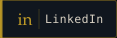
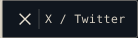
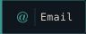
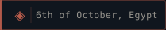

<p align="center">
  <a href="https://www.linkedin.com/in/ahmed-sha-ban-006a24309/"></a>
  <a href="https://x.com/AhmdShbnn"></a>
  <a href="https://www.facebook.com/profile.php?id=100010999923328"></a>
  <a href="mailto:a.shaban2366@nu.edu.eg"></a>
  
</p>

---

I ship finished products rather than practice projects. Booking systems with live queues, multiplayer games with real-time state, AI assistants that answer in under a second.

Most of them ship **Arabic-first** — real RTL layout designed from the start, not a translation bolted on at the end. That's the part I care about: good software shouldn't feel like a foreign import to the people using it.

---

## Selected work

<table>
  <tr>
    <td width="50%"><a href="https://github.com/Lord-shaban/Nota"></a></td>
    <td width="50%"><a href="https://github.com/Lord-shaban/lord-ai"></a></td>
  </tr>
  <tr>
    <td width="50%"><a href="https://github.com/Lord-shaban/Classic-Barber-App"></a></td>
    <td width="50%"><a href="https://github.com/Lord-shaban/lordlitor"></a></td>
  </tr>
  <tr>
    <td width="50%"><a href="https://github.com/Lord-shaban/top10-game"></a></td>
    <td width="50%"><a href="https://github.com/Lord-shaban/neurobalance"></a></td>
  </tr>
</table>

<p align="right"><a href="https://github.com/Lord-shaban?tab=repositories"><b>Every repository →</b></a></p>

---

## Stack


---

## Activity



<picture>
  <source media="(prefers-color-scheme: dark)" srcset="https://github.com/Lord-shaban/profile-readme/raw/output/github-contribution-grid-snake-dark.svg" />
  
</picture>

---

## How this page is built

Every image above is generated by this repository — there is no third-party badge or stats service anywhere on the page.

| | |
| :-- | :-- |
| [`scripts/lib/theme.mjs`](scripts/lib/theme.mjs) | One palette, one type scale, one geometric motif. Every asset draws from it and nothing else. |
| [`scripts/build-terminal.mjs`](scripts/build-terminal.mjs) | The shell session up top. Typing is `clip-path` animated with a `steps(n)` function where *n* is the character count, so the reveal lands on glyph boundaries. Timings are computed, not hand-tuned. |
| [`scripts/build-cards.mjs`](scripts/build-cards.mjs) | Project cards. Prose from [`data/projects.json`](data/projects.json), stars and language from the GitHub API at build time. |
| [`scripts/build-stats.mjs`](scripts/build-stats.mjs) | The numbers panel, including a language split weighted by bytes actually written rather than repository count. |
| [`scripts/check-assets.mjs`](scripts/check-assets.mjs) | CI gate: every SVG well-formed and labelled, every README reference resolving, every repo link alive. A broken SVG renders as a silent broken image on GitHub, so this fails the build instead. |

Everything is zero-dependency ESM — no `node_modules`, nothing to audit. [A scheduled workflow](.github/workflows/refresh.yml) re-runs the build daily and commits only when the output actually changes.

```console
$ npm run build && npm run check
✓ 15 SVGs well-formed · 15 README references resolve · 7 repo links checked
```

Motion is opt-in throughout: every animated asset collapses to its final frame under `prefers-reduced-motion: reduce`.

---

## Get in touch

Open to collaborating on AI-powered apps, Flutter work, and anything that makes good software feel native in Arabic.

<p align="center">
  <a href="https://www.linkedin.com/in/ahmed-sha-ban-006a24309/"></a>
  <a href="mailto:a.shaban2366@nu.edu.eg"></a>
</p>

<p align="center">
  <sub><i>"To create tech that inspires and empowers humanity."</i></sub>
</p>

<p align="center">🍉 <b>Free Palestine</b></p>
