  
  
  
  

---

I'm a software engineering student at **Nile University** who ships finished products rather than practice projects. Booking systems with live queues, multiplayer games with real-time state, AI assistants that answer in under a second.

Most of them ship **Arabic-first** — real RTL layout designed from the start, not a translation bolted on at the end. That's the part I care about: good software shouldn't feel like a foreign import to the people using it.

Right now I'm going deeper on Laravel and Firebase Cloud, and building more of my apps around LLMs. I also lead the team at **Abakera NU**.

---

## Selected work

| Project | What it does | Stack |
| :-- | :-- | :-- |
| **[Nota](https://github.com/Lord-shaban/Nota)** | Notes and diary app that files your entries for you. Capture by text, voice or image; AI sorts them into categories. Full Arabic support. | Flutter · Firebase |
| **[LORD AI](https://github.com/Lord-shaban/lord-ai)** | AI assistant running Llama 3.3 70B on Groq's LPU, so replies land almost instantly. Ships with a music player and **zero dependencies**. | JavaScript · Groq |
| **[Classic Barber](https://github.com/Lord-shaban/Classic-Barber-App)** | Booking app for barber shops with a live queue customers can watch, plus WhatsApp confirmations. Built Arabic-first. | Flutter · Firebase |
| **[Lordlitor](https://github.com/Lord-shaban/lordlitor)** | Mental-arithmetic trainer in the shape of a language app. 21 calculation patterns across 5 categories, difficulty adapts as you go. | Flutter · Dart |
| **[Top 10](https://github.com/Lord-shaban/top10-game)** | Real-time football trivia. You and your friends race to name the top ten before anyone else does. | JavaScript · Realtime |
| **[NeuroBalance](https://github.com/Lord-shaban/neurobalance)** | Cognitive training experiment — testing whether short daily drills hold attention better than long sessions. | Flutter · Dart |

<a href="https://github.com/Lord-shaban?tab=repositories"><b>All 42 repositories →</b></a>

---

## Stack

---

## Activity

  
  

---

## Get in touch

Open to collaborating on AI-powered apps, Flutter work, and anything that makes good software feel native in Arabic.

  

  <i>“To create tech that inspires and empowers humanity.”</i>

🍉 <b>Free Palestine</b>

