<p align="center">
  <a href="https://www.linkedin.com/in/ahmed-sha-ban-006a24309/"></a>
  <a href="https://x.com/AhmdShbnn"></a>
  <a href="https://www.facebook.com/profile.php?id=100010999923328"></a>
  <a href="mailto:a.shaban2366@nu.edu.eg"></a>
  
</p>

I ship finished products rather than practice projects — booking systems with live queues, multiplayer games with real-time state, AI assistants that answer in under a second.

Right now I'm going deeper on Laravel and Firebase Cloud, and building more of my apps around LLMs.

<br />

## Selected work

<table>
  <tr>
    <td width="50%"><a href="https://github.com/Lord-shaban/Nota"></a></td>
    <td width="50%"><a href="https://github.com/Lord-shaban/lord-ai"></a></td>
  </tr>
  <tr>
    <td width="50%"><a href="https://github.com/Lord-shaban/Classic-Barber-App"></a></td>
    <td width="50%"><a href="https://github.com/Lord-shaban/lordlitor"></a></td>
  </tr>
  <tr>
    <td width="50%"><a href="https://github.com/Lord-shaban/top10-game"></a></td>
    <td width="50%"><a href="https://github.com/Lord-shaban/neurobalance"></a></td>
  </tr>
</table>

<p align="right"><a href="https://github.com/Lord-shaban?tab=repositories"><b>Every repository →</b></a></p>

<br />

## Stack


<br />

## Activity


<picture>
  <source media="(prefers-color-scheme: dark)" srcset="https://github.com/Lord-shaban/profile-readme/raw/output/github-contribution-grid-snake-dark.svg" />
  
</picture>

<br />

## How this page is built

Every image above is generated by this repository. There is no badge service, no stats service, and no third party anywhere on the page.

| | |
| :-- | :-- |
| [`lib/theme.mjs`](scripts/lib/theme.mjs) | One syntax palette, one type scale, one set of primitives. Every asset draws from it and nothing else. |
| [`lib/highlight.mjs`](scripts/lib/highlight.mjs) | A ~40-line TypeScript tokenizer. Enough grammar to colour the hero correctly, without a dependency or a parse tree. |
| [`build-hero.mjs`](scripts/build-hero.mjs) | The editor window. Typing is `clip-path` animated with `steps(n)` where *n* is the line's character count, so the reveal lands on glyph boundaries. Timings are derived from the source, so editing the code cannot desynchronise them. |
| [`build-cards.mjs`](scripts/build-cards.mjs) | Project cards — prose from [`data/projects.json`](data/projects.json), stars and language from the GitHub API at build time. |
| [`build-stack.mjs`](scripts/build-stack.mjs) | Chips that wrap to as many rows as they need; the canvas height is measured from the result, so the data file can never overflow the artwork. |
| [`build-stats.mjs`](scripts/build-stats.mjs) | The numbers, including a language split weighted by bytes actually written rather than repository count. |
| [`check-assets.mjs`](scripts/check-assets.mjs) | CI gate: every SVG well-formed and labelled, every README reference resolving, every repo link alive. |

That last one matters more than it sounds — GitHub renders a malformed SVG as a silent broken image, so without a check the page can break and look fine in the diff.

```console
$ npm run build && npm run check
✓ 14 SVGs well-formed · 14 README references resolve · 6 repo links checked
```

Zero dependencies, no `node_modules`, nothing to audit. [A scheduled workflow](.github/workflows/refresh.yml) rebuilds daily and commits only when the output actually changed.

Motion is opt-in throughout: every animation is CSS, declared so that it fails visible, and collapses to its final frame under `prefers-reduced-motion: reduce`.

<br />

## Get in touch

Open to collaborating on AI-powered apps, Flutter work, and anything with a hard real-time requirement.

<p align="center">
  <a href="https://www.linkedin.com/in/ahmed-sha-ban-006a24309/"></a>
  <a href="mailto:a.shaban2366@nu.edu.eg"></a>
</p>

<p align="center"><sub><i>"To create tech that inspires and empowers humanity."</i></sub></p>

<p align="center">🍉 <b>Free Palestine</b></p>
